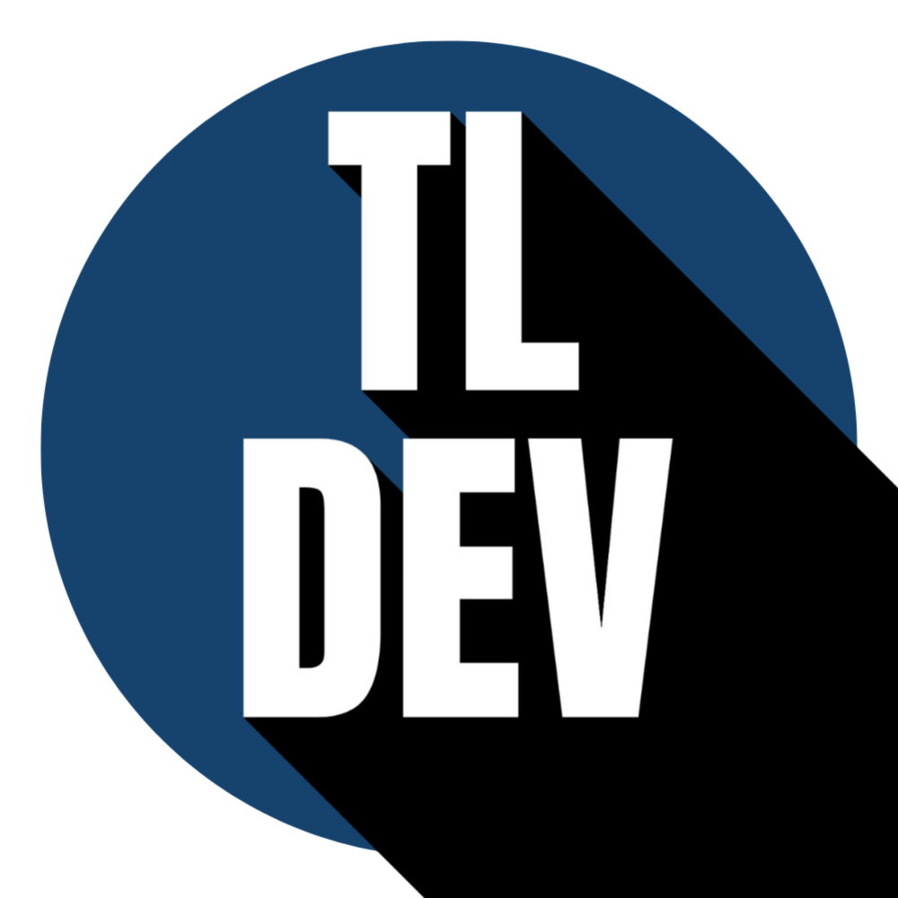

# 🌐 Tradutor TL

<p align="center">
  
</p>

<p align="center">
  Um tradutor simples e moderno desenvolvido com HTML, CSS e JavaScript 🚀
</p>

---

## 🛡️ Tecnologias

<p align="center">
  
  
  
  
</p>

---

## 🚀 Funcionalidades

* 🔤 Tradução de texto em tempo real
* 🌍 Suporte a múltiplos idiomas
* 🎤 Entrada por voz (Speech Recognition)
* ⚡ Interface simples e rápida
* 🎨 Design moderno

---

## 📂 Estrutura do projeto

```bash
📁 TRADUTOR
 ├── index.html
 ├── style.css
 ├── script.js
 └── assets/
     ├── logo2.png
     ├── traduzir.svg
     ├── microfone.svg
```

---

## ▶️ Como usar

```bash
git clone https://github.com/thiagolucass/tradutor-tl.git
cd TRADUTOR
```

Abra o arquivo `index.html` no navegador.

---

## ⚠️ Observações

* O reconhecimento de voz funciona melhor no Google Chrome
* A API utilizada pode ter limitações

---

## 👨‍💻 Autor

**Thiago Lucas**

<p>
  <a href="https://github.com/thiagolucass">
    
  </a>
</p>

---

## ⭐ Contribuição

Se você gostou do projeto, deixe uma ⭐ no repositório!

---

## 📌 Licença

Projeto desenvolvido para fins de estudo e portfólio.
